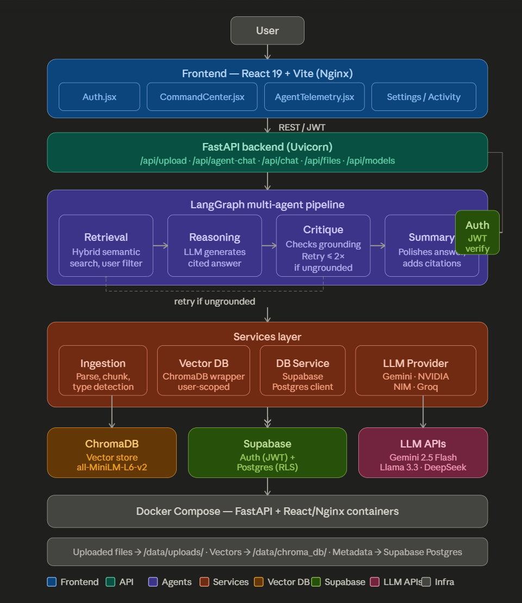

<div align="center">

# DocuMind AI

**An intelligent, multi-tenant document interrogation platform powered by a LangGraph multi-agent pipeline.**

Upload documents, ask questions in natural language, and receive grounded answers with citations.

[](https://python.org)
[](https://fastapi.tiangolo.com)
[](https://react.dev)
[](https://supabase.com)
[](https://langchain-ai.github.io/langgraph/)
[](https://trychroma.com)
[](https://docker.com)

</div>

---

## What is DocuMind?

DocuMind is a **production-ready, AI-powered document Q&A platform** that lets users upload documents (PDF, TXT, CSV) and interrogate them using natural language. Unlike simple RAG chatbots, DocuMind runs a full **multi-agent reasoning pipeline** that retrieves relevant content, generates a grounded answer, self-critiques it, and refines the output — all in real time.

Every user gets their own private workspace. Documents uploaded by User A are never accessible to User B.

---

## Architecture Overview



```
User Query
    │
    ▼
┌─────────────────┐     ┌─────────────────┐     ┌──────────────────┐     ┌──────────────────┐
│  Retrieval Agent │────▶│ Reasoning Agent │────▶│  Critique Agent  │────▶│  Summary Agent   │
│                  │     │                 │     │                  │     │                  │
│ Hybrid semantic  │     │  LLM generates  │     │ Checks grounding │     │ Polishes answer  │
│ search on ChromaDB│    │  raw answer     │     │ & detects false  │     │ with citations   │
│ filtered by user │     │  with citations │     │ refusals. Retries│     │                  │
└─────────────────┘     └─────────────────┘     │ up to 2 times if │     └──────────────────┘
                                                  │ not grounded     │
                                                  └──────────────────┘
```

**Key Design Principles:**
- **Grounded answers only** — the Critique Agent verifies every answer against the source chunks before it reaches the user.
- **Multi-tenant isolation** — every ChromaDB query and Postgres record is scoped to the authenticated user's ID.
- **Provider-agnostic LLM routing** — supports Gemini, NVIDIA NIM, and Groq; switch models per query from the UI.
- **Self-healing retrieval** — if the Critique Agent flags an answer as ungrounded, the pipeline rewrites the query and retries automatically.
- **Operator controls** — response sensitivity and retrieval depth can be adjusted from the Settings panel.

---

## Features

| Feature | Details |
|---|---|
| **Document Upload** | PDF, TXT, CSV support up to 50MB with intelligent chunking (glossary, table, reference, content) |
| **Multi-Agent Pipeline** | LangGraph stateful graph with 4 specialized agents: Retrieval → Reasoning → Critique → Summary |
| **Semantic Search** | HuggingFace embeddings (`BAAI/bge-base-en-v1.5`) stored in ChromaDB with user-scoped metadata filters |
| **Authentication** | Supabase Auth (email/password) with JWT validation; full per-user data isolation |
| **Multi-Tenant** | Users only see and query their own documents — enforced at both the API and database (Postgres RLS) layers |
| **Self-Healing Storage** | Fully purges orphaned document vectors across Postgres, disk, and ChromaDB upon source deletion |
| **Source Citations** | Every answer includes `[Source N]` citations referencing the exact document, page, and relevance score |
| **Self-Critique & Retry** | Critique Agent detects hallucinations and false refusals; rewrites the retrieval query and retries up to 2 times |
| **Multi-Provider LLM** | Switch between Gemini 2.5 Flash, Llama 3.3 70B (NVIDIA / Groq), MiniMax m2.7 from the UI |
| **Agent Telemetry** | Live sidebar shows each agent's status (Waiting → Processing → Complete) in real time |
| **Runtime Controls** | Settings panel supports configurable LLM sensitivity (temperature) and retrieval depth (top-k) |
| **Activity Log** | Activity panel shows recent query outcomes, model selection, scope, and execution settings |
| **Docker Ready** | Single `docker-compose up` brings up the full stack (FastAPI backend + React frontend via Nginx) |

---

## Tech Stack

### Backend
- **[FastAPI](https://fastapi.tiangolo.com/)** — async REST API
- **[LangGraph](https://langchain-ai.github.io/langgraph/)** — stateful multi-agent orchestration
- **[ChromaDB](https://trychroma.com/)** — local vector database for semantic search
- **[Sentence-Transformers](https://sbert.net/)** — local embedding model (`BAAI/bge-base-en-v1.5`)
- **[Supabase](https://supabase.com/)** — authentication (Auth) + PostgreSQL for file metadata
- **[python-docx](https://python-docx.readthedocs.io/) / [pypdf](https://pypdf.readthedocs.io/)** — document parsing

### Frontend
- **[React 19](https://react.dev/)** — component-based UI
- **[Vite](https://vitejs.dev/)** — fast dev server and bundler
- **[Supabase JS](https://supabase.com/docs/reference/javascript)** — client-side auth session management
- **[Lucide React](https://lucide.dev/)** — icon library
- **Vanilla CSS** — custom design system, dark theme, glassmorphism

### Infrastructure
- **[Docker + Docker Compose](https://docker.com/)** — containerized deployment
- **[Nginx](https://nginx.org/)** — serves the React frontend in production
- **[Uvicorn](https://www.uvicorn.org/)** — ASGI server for FastAPI

### LLM Providers
- **[Google Gemini](https://ai.google.dev/)** — Gemini 2.5 Flash
- **[NVIDIA NIM](https://build.nvidia.com/)** — Llama 3.3 70B, Llama 3.1 8B, MiniMax m2.7
- **[Groq](https://groq.com/)** — Llama 3.1 8B (ultra-fast inference), Llama 3.3 70B

---

## Project Structure

```
DocuMind/
├── backend/
│   ├── agents/                  # Specialized AI agents
│   │   ├── retrieval_agent.py   # Hybrid semantic search
│   │   ├── reasoning_agent.py   # LLM answer generation
│   │   ├── critique_agent.py    # Grounding checker + retry logic
│   │   └── summary_agent.py     # Answer polisher
│   ├── api/
│   │   ├── deps.py              # JWT auth dependency (Supabase)
│   │   └── routes/              # FastAPI route handlers
│   │       ├── upload.py        # Document ingestion endpoint
│   │       ├── chat.py          # Direct RAG + multi-agent chat
│   │       ├── files.py         # User document listing
│   │       └── query.py         # Direct vector search
│   ├── core/
│   │   ├── config.py            # Centralized settings (env vars)
│   │   └── logger.py            # Structured logging
│   ├── orchestrator/
│   │   └── langgraph_flow.py    # LangGraph pipeline definition
│   ├── services/
│   │   ├── ingestion.py         # Document parsing + chunking pipeline
│   │   ├── vector_db_service.py # ChromaDB wrapper
│   │   ├── db_service.py        # Supabase Postgres client
│   │   └── llm_provider.py      # Unified multi-provider LLM router
│   └── utils/
│       ├── chunking.py          # Smart chunk-type detection
│       └── pdf_parser.py        # PDF text extraction
├── ml/
│   ├── embeddings/embedder.py   # Sentence-Transformers wrapper
│   └── retriever/hybrid_search.py # ChromaDB semantic search + filters
├── frontend/
│   ├── src/
│   │   ├── contexts/AuthContext.jsx  # Global auth state
│   │   ├── lib/
│   │   │   ├── supabase.js           # Supabase client
│   │   │   ├── userPreferences.js    # Settings persistence
│   │   │   └── activityLog.js        # Local activity history
│   │   ├── pages/
│   │   │   ├── Auth.jsx              # Login / Register page
│   │   │   ├── CommandCenter.jsx     # Main app interface
│   │   │   ├── Settings.jsx          # Runtime controls
│   │   │   └── Activity.jsx          # Query activity history
│   │   ├── components/
│   │   │   ├── chat/AgentTelemetry.jsx  # Live agent status panel
│   │   │   ├── chat/ChatMessages.jsx    # Chat message renderer
│   │   │   └── chat/DocumentList.jsx    # Sidebar document list
│   │   └── api/client.js              # Authenticated API client
│   ├── public/                        # Static assets
│   └── .env.example                   # Frontend env template
├── data/
│   ├── uploads/                 # Uploaded files (gitignored)
│   └── chroma_db/               # Vector database (gitignored)
├── schema.sql                   # Supabase Postgres schema + RLS
├── docker-compose.yml           # Full-stack compose config
├── requirements.txt             # Python dependencies
├── .env.example                 # Backend env template
└── README.md
```

---

## Quick Start

### Prerequisites
- **Python 3.11+**
- **Node.js 20+**
- **Git**
- A free [Supabase](https://supabase.com) account
- At least one LLM API key ([Gemini](https://ai.google.dev/), [NVIDIA](https://build.nvidia.com/), or [Groq](https://console.groq.com/))

---

### 1. Clone the Repository

```bash
git clone https://github.com/AkshatPal2007/DocuMind-AI.git
cd DocuMind-AI
```

---

### 2. Set up Supabase

1. Go to [supabase.com](https://supabase.com) and create a new project.
2. In your project dashboard, navigate to **SQL Editor** and run the contents of `schema.sql` to create the `files` table and Row Level Security policies.
3. From **Project Settings → API**, copy:
   - **Project URL** (e.g. `https://xxxx.supabase.co`)
   - **`anon` public key** (for the frontend)
   - **`service_role` secret key** (for the backend)
   - **JWT Secret** (from Settings → API → JWT Settings)

---

### 3. Configure Environment Variables

**Backend** — copy and fill in the root `.env`:
```bash
cp .env.example .env
```
```env
GEMINI_API_KEY=your-gemini-key          # Get from aistudio.google.com
NVIDIA_API_KEY=your-nvidia-key          # Get from build.nvidia.com
GROQ_API_KEY=your-groq-key             # Get from console.groq.com

SUPABASE_URL=https://xxxx.supabase.co  # From Supabase Settings > API
SUPABASE_KEY=your-service-role-key     # Use the service_role key (not anon)
SUPABASE_JWT_SECRET=your-jwt-secret    # From Supabase Settings > API > JWT
```

**Frontend** — copy and fill in `frontend/.env`:
```bash
cp frontend/.env.example frontend/.env
```
```env
VITE_SUPABASE_URL=https://xxxx.supabase.co  # Same URL as above
VITE_SUPABASE_ANON_KEY=your-anon-key        # Use the anon key (not service_role)
```

> **Note:** You only need one LLM provider key to get started. Gemini or Groq both have generous free tiers.

---

### 4. Option A — Run with Docker (Recommended for Production)

```bash
docker-compose up -d --build
```

- Frontend → `http://localhost`
- Backend API → `http://localhost:8000`
- API Docs → `http://localhost:8000/docs`

---

### 5. Option B — Run Locally (Recommended for Development)

#### Backend

```bash
# Create and activate a virtual environment
python3 -m venv venv
source venv/bin/activate          # On Windows: venv\Scripts\activate

# Install dependencies
pip install -r requirements.txt

# Start the backend server
uvicorn backend.main:app --reload
```

The API will be live at `http://localhost:8000`.
Interactive API docs at `http://localhost:8000/docs`.

#### Frontend

```bash
cd frontend
npm install
npm run dev
```

The app will open at `http://localhost:5173`.

---

## Getting Your API Keys

| Provider | Free Tier | Link |
|---|---|---|
| **Google Gemini** | Yes — 1500 req/day for Flash | [aistudio.google.com](https://aistudio.google.com/app/apikey) |
| **NVIDIA NIM** | Yes — credits on sign-up | [build.nvidia.com](https://build.nvidia.com) |
| **Groq** | Yes — fast inference free tier | [console.groq.com](https://console.groq.com/keys) |
| **Supabase** | Yes — generous free tier | [supabase.com](https://supabase.com) |

---

## How It Works

### Document Ingestion Pipeline
1. **Upload** — user uploads a PDF/TXT/CSV via the UI.
2. **Parse** — file is parsed page-by-page using `PyPDF` / `TextLoader`.
3. **Chunk** — text is split into 500-character chunks with 150-char overlap using `RecursiveCharacterTextSplitter`.
4. **Type Detection** — each chunk is classified (content / reference / table / header / noise) to aid future filtering.
5. **Embed** — chunks are converted to 768-dimensional vectors using `BAAI/bge-base-en-v1.5` (runs locally, no API cost).
6. **Store** — vectors + metadata (including `user_id` and `file_name`) are stored in ChromaDB.
7. **Record** — file metadata is saved to Supabase Postgres for display in the UI.

### Query Pipeline (Multi-Agent)
1. **Retrieval Agent** — performs a semantic search filtered by the authenticated user's ID. Returns top-k chunks with relevance scores.
2. **Reasoning Agent** — sends the chunks + user question to the chosen LLM. Generates a cited answer using `[Source N]` notation.
3. **Critique Agent** — validates the answer: Is it grounded in the context? Did the LLM refuse when the context actually had the answer? If not grounded, rewrites the query and loops back to Retrieval (max 2 retries).
4. **Summary Agent** — polishes the final answer for clarity and structure while preserving all citations.

### Runtime Controls
- **LLM Sensitivity** — maps to model temperature for stricter or more creative phrasing.
- **Retrieval Depth** — controls top-k chunks used in each query.
- **Activity Tracking** — records recent query status, model, scope, and execution settings in the Activity panel.

---

## Security

- **JWT Authentication** — every protected API endpoint validates the Bearer token against Supabase Auth using `supabase.auth.get_user()`.
- **Row Level Security (RLS)** — Supabase Postgres enforces that users can only `SELECT`, `INSERT`, `UPDATE`, and `DELETE` their own rows in the `files` table.
- **ChromaDB Isolation** — all vector similarity searches are filtered by `user_id` using ChromaDB's `$and`/`$eq` metadata filter operators.
- **Environment Variables** — all secrets are loaded from `.env` files which are gitignored. No keys are ever committed to the repository.
- **Service Role vs Anon Key** — the backend uses the Supabase `service_role` key for admin DB access, while the frontend uses the public `anon` key for client-side auth.

---

## API Reference

All endpoints are documented interactively at `http://localhost:8000/docs`.

| Method | Endpoint | Auth | Description |
|---|---|---|---|
| `POST` | `/api/upload` | Required | Upload and ingest a document (up to 50MB) |
| `DELETE` | `/api/files/{file_name}` | Required | Deep-delete document (Disk, Postgres, and ChromaDB) |
| `POST` | `/api/agent-chat` | Required | Multi-agent pipeline query (supports `k`, `model`, `file_name`, `temperature`) |
| `POST` | `/api/chat` | Required | Direct single-LLM RAG query (supports `k`, `model`, `temperature`) |
| `GET` | `/api/files` | Required | List user's documents (Auto-prunes broken links) |
| `GET` | `/api/models` | Public | List available LLM models |

---

## Contributing

Contributions are welcome! Please follow these steps:

1. Fork the repository
2. Create a feature branch: `git checkout -b feat/your-feature-name`
3. Commit your changes: `git commit -m 'feat: add your feature'`
4. Push to the branch: `git push origin feat/your-feature-name`
5. Open a Pull Request

---

## License

This project does not currently include an open-source license.

---

<div align="center">

Built by [Akshat Pal](https://github.com/AkshatPal2007)

</div>
